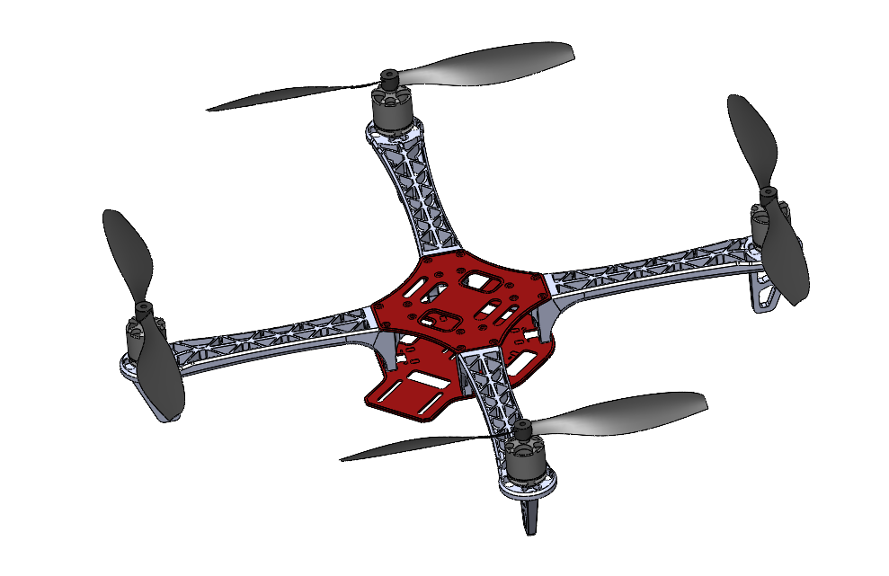
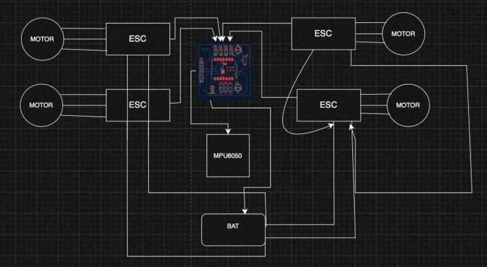

# Esp_fly
Custom BLDC ESC and an ESP-based flight controller 

Custom Drone Electronics (ESC + ESP Flight Controller)

A fully custom-built drone electronics stack including:
 ESP-based Flight Controller
 30A BLDC Electronic Speed Controller (ESC)

## Overview
This project focuses on building a complete custom drone control system  instead of using off-the-shelf components.

It includes:
ESC design for BLDC motors  
Flight controller using ESP microcontroller  
Schematic + PCB design  
Component selection and optimization  

## Learning & Inspiration
Before building, I explored:
BLDC motor control and ESC architecture  
Flight controller design basics  
Sensor interfacing and control systems  
Open-source projects  

## References
Electronoobs ESC  
BlueESC (SimonK firmware)  
Various open-source drone FC designs  

## Features
Flight Controller
ESP-based microcontroller  
Multiple motor outputs (quad configuration)  
Designed for sensor integration (MPU6050)  
Custom PCB layout  

## ESC
Designed for ~30A current  
3-phase BLDC motor control  
MOSFET-based power stage  
Compact 2-layer PCB  

##PCB Design

 ### Flight Controller

### ESC

## Frame

## Schematics

## BOM

| Name                                                     | Purpose                                      | Quantity |
|----------------------------------------------------------|----------------------------------------------|----------|
| shipping                                                 | shipping                                     | 1        |
| AON7544-XBL-W 30V 100A 62.5W 5.5mΩ 10V,30A 2.5V@250uA    | mosfets                                      | 20       |
| FlySky FS-iA10B Radio Receiver                           | receiver                                     | 1        |
| esc pcb and pcba                                         | speed controller                             | 1        |
| FLIGHT CONTROLLER PCB                                    | PRINTED CIRCUIT BOARD                        | 1        |
| 1045 PROPELLERS                                          | PUSH AIR TOWARDS THE GROUND TO GENERATE LIFT | 1        |
| MOTOR CCW                                                | THRUST                                       | 2        |
| MOTORS CW                                                | THRUST                                       | 2        |
| F450                                                     | FRAME                                        | 1        |
| MPU6050                                                  | IMU                                          | 1        |
| XIAO ESP32 S3                                            | MICROCONTROLLER                              | 1        |
## Acknowledgements

- Open-source ESC community  
- Electronoobs  
- Blue Robotics  

